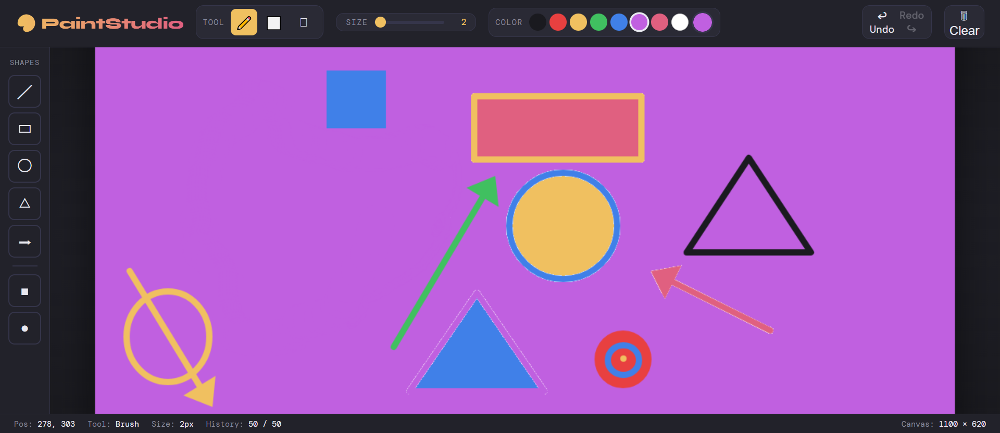
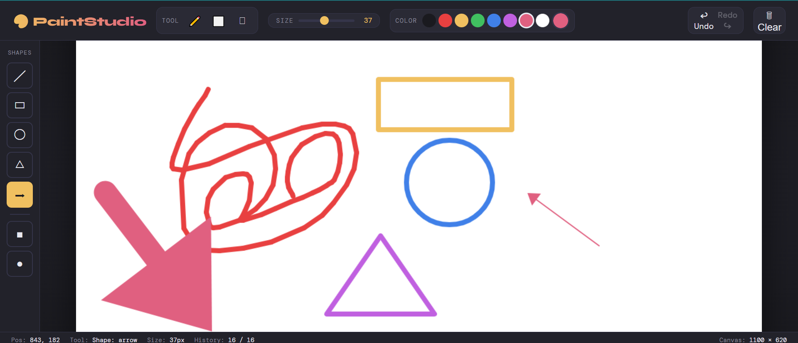

# 🎨 Canvas Paint Studio

A browser-based painting tool built with HTML, CSS, and JavaScript — no libraries, no dependencies.

---

## 🖼️ Preview

**Basic drawing with shapes (brush, rectangle, circle, triangle, arrow)**

**Fill tool & layered shapes on a colored background**

---

## ✨ Features

- 🖌️ Brush, Eraser, Flood Fill
- 🔷 Shapes — Line, Rectangle, Circle, Triangle, Arrow, Filled variants
- 🎨 Color swatches + custom color picker
- 📏 Brush size slider (1–80px)
- ↩ Undo / Redo (up to 50 steps)
- ⌨️ Keyboard shortcuts (`B`, `E`, `F`, `[`, `]`, `Ctrl+Z/Y`)

---

